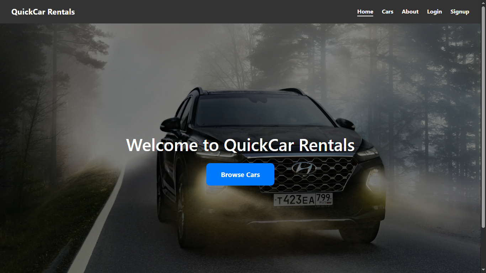
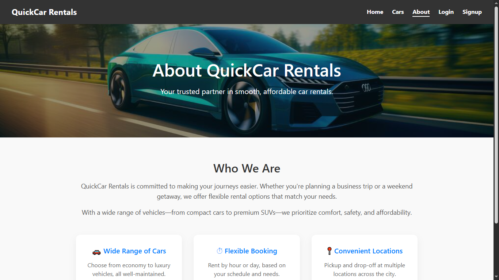
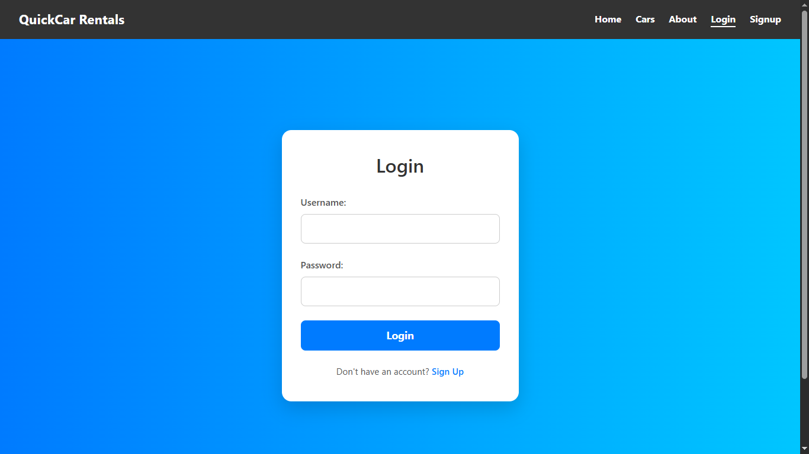
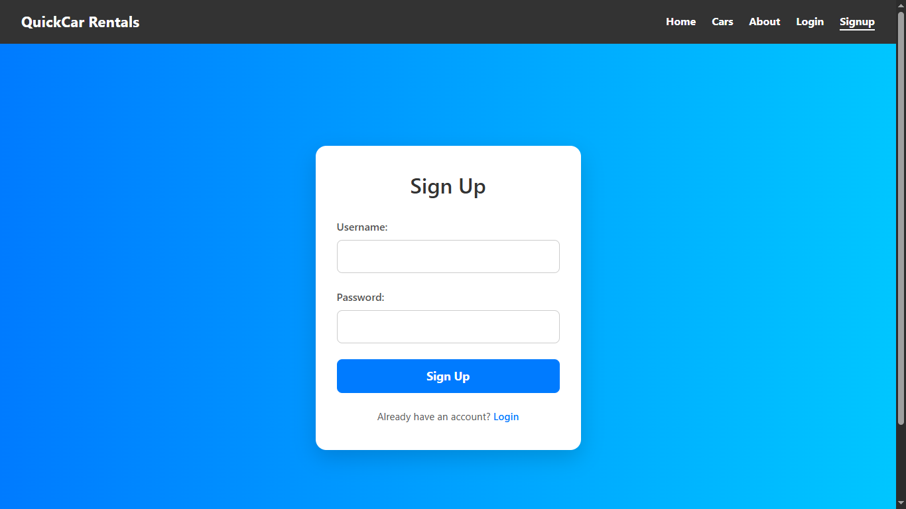

# Car Rental Website 🚗

A full-stack car rental website with:

- Frontend: Angular
- Backend: Django (REST API)
- Database: MySQL

## 📝 Features
- Car details
- User login/signup
- Car booking 

## 📸 Screenshots
### 🔹 Homepage

### 🔹 Cars Page

### 🔹 About Page

### 🔹 Login Page

### 🔹 Signup Page

## 📂 Folder Structure
frontend/ → carRental_fronted

backend/ → carRental_backend

## 📝 Requirements
- Python 3.x
- Django 3.x
- MySQL
- Angular 10.x
- Django REST Framework

## 💻 How to run
1. Install the requirements
2. Create a virtual environment
3. Activate the virtual environment
4. Install the dependencies
5. Run the server
6. Access the website
